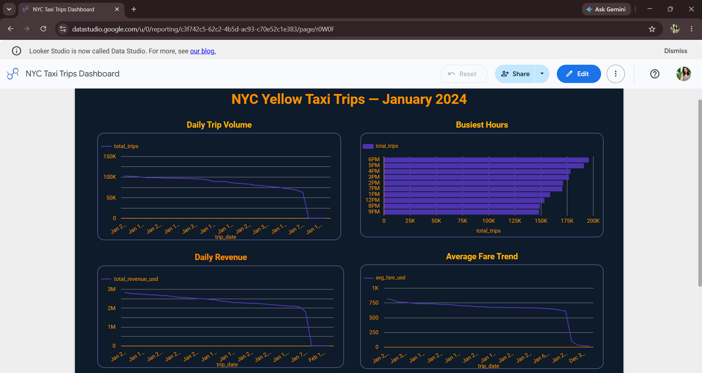

# NYC Taxi ETL Pipeline

End-to-end data engineering pipeline ingesting NYC TLC taxi trip data into BigQuery, transforming with dbt, and visualizing in Looker Studio.

## Live Dashboard

[View Dashboard](https://datastudio.google.com/reporting/c3f742c5-62c2-4b5d-ac93-c70e52c1e383)

## Architecture

NYC TLC Data → Apache Airflow (orchestration) → BigQuery (raw_trips)
                                                       ↓
                                               dbt (staging + mart models)
                                                       ↓
                                            Looker Studio (dashboard)

## Dashboard Preview


## Stack

| Layer | Tool |
|---|---|
| Orchestration | Apache Airflow 2.9.1 (Docker) |
| Transformation | dbt-bigquery 1.8.0 |
| Data Warehouse | GCP BigQuery |
| Visualization | Looker Studio |
| Infrastructure | Docker Desktop (Windows) |

## Pipeline DAG

Three tasks run in sequence:

1. `download_and_load` - Downloads NYC TLC Parquet files, loads to `raw_trips`
2. `run_dbt_staging` - Runs `stg_trips` model (type casting, null handling)
3. `run_dbt_mart` - Runs `mart_trips_daily` model (daily aggregations)

## BigQuery Tables

| Table | Rows | Description |
|---|---|---|
| `raw_trips` | 2,960,000+ | Raw ingested data |
| `stg_trips` | 2,960,000+ | Cleaned and typed |
| `mart_trips_daily` | ~365 | Daily aggregates |

## Dashboard Charts

- Daily Trip Volume
- Busiest Hours of the Day
- Daily Revenue Trend
- Average Fare per Trip Trend

## Project Structure

```
nyc-taxi-etl/
├── dags/                    # Airflow DAG definitions
├── dbt/
│   ├── models/
│   │   ├── staging/         # stg_trips.sql
│   │   └── mart/            # mart_trips_daily.sql
│   └── dbt_project.yml
└── docker-compose.yml
```

## Setup

### Prerequisites
- Docker Desktop
- GCP account with BigQuery enabled
- GCP service account key (JSON) with BigQuery Admin role

### Run Locally

```bash
git clone https://github.com/Krishnamadhu325/nyc-taxi-etl.git
cd nyc-taxi-etl

# Add your GCP service account key
cp /path/to/your-key.json gcp-key.json

# Start Airflow
docker-compose up -d

# Open Airflow UI at http://localhost:8080 (admin / admin)
# Trigger DAG: nyc_taxi_pipeline
```

## Key Learnings

- Resolved Docker volume mount issues on Windows for GCP key injection
- Debugged dbt-BigQuery profile configuration inside Airflow containers
- Managed GCP service account IAM permissions for automated pipeline access
- Built mart layer aggregations optimized for Looker Studio direct connect

## Author

Krishna K M | BCA 2026, YIASCM  
GitHub: https://github.com/Krishnamadhu325